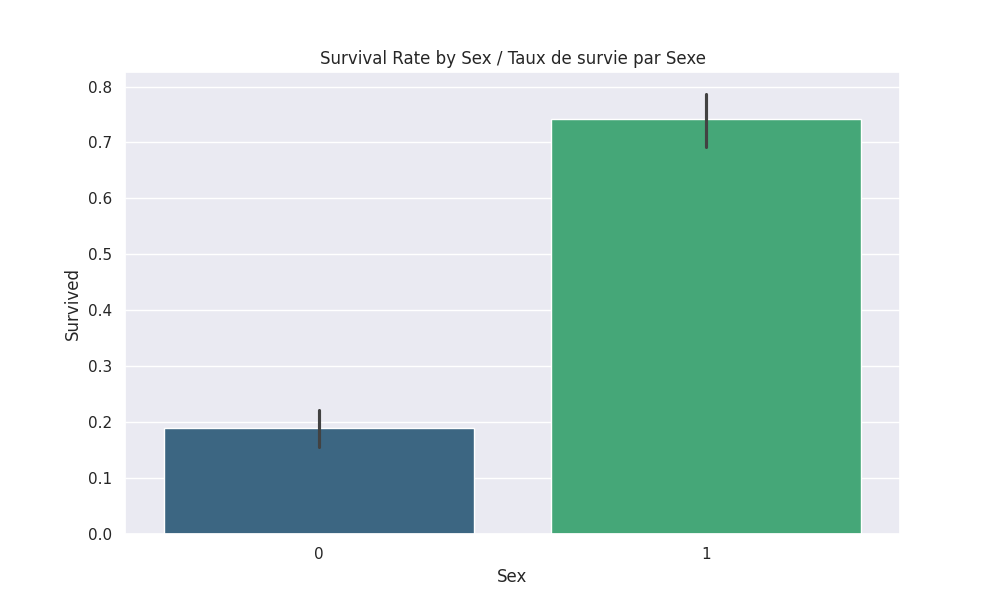
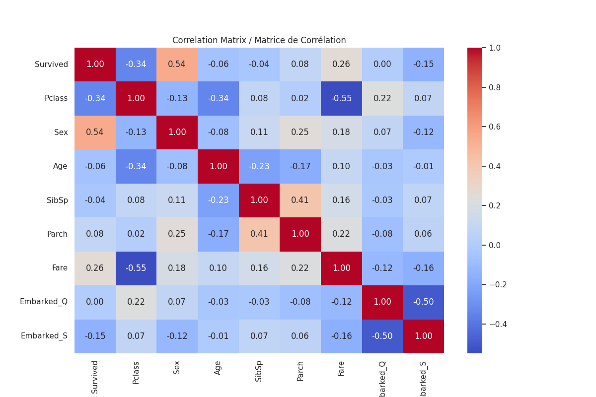

 
# 🚢 Titanic Survival Analysis 

## Project Overview
This project is part of my Machine Learning internship. The goal is to perform data preprocessing and Exploratory Data Analysis (EDA) on the famous Titanic dataset.

## Tasks Performed 
* **Data Cleaning:** Handled missing values (Age, Embarked) and removed unnecessary columns (Cabin, Name, Ticket).

* **Feature Encoding:** Converted categorical data (Sex, Embarked) into numerical format.

* **Data Scaling:** Applied StandardScaler to normalize Age and Fare.

* **EDA:** Created visualizations to understand correlations between survival and features (Class, Sex).

## Key Insights 
- **Sex:** Females had a significantly higher survival rate (Correlation: 0.54).

- **Pclass:** 1st class passengers had better chances of survival than 3rd class.
-
## Tools 
- Python (Pandas, Seaborn, Matplotlib, Scikit-Learn)

## Visualizations
### Survival by Sex

### Correlation Heatmap

